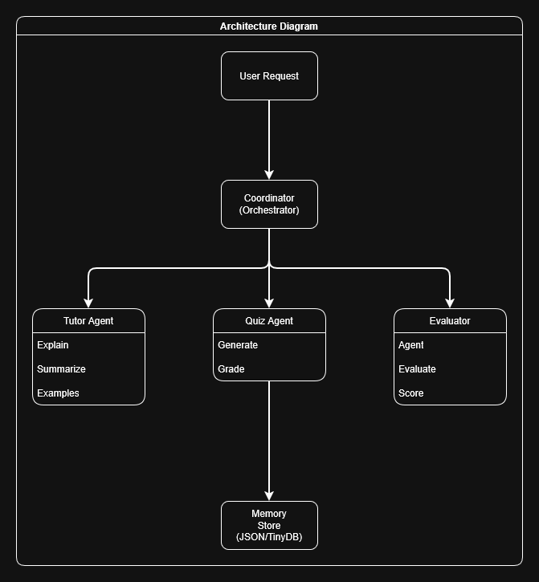

# Educational Tutor Agent — Multi-Agent AI Tutor with Quiz & Evaluation

> **Capstone Project** for the **AI Agents Intensive Course with Google** offered on Kaggle  
> **Track**: Agents for Good (Education)


---

## Table of Contents

1. [Project Overview](#project-overview)
2. [Problem Statement](#problem-statement)
3. [Why This Problem Matters](#why-this-problem-matters)
4. [Solution Summary](#solution-summary)
5. [Architecture Diagram](#architecture-diagram)
6. [Multi-Agent System Description](#multi-agent-system-description)
7. [Tools & Technologies Used](#tools--technologies-used)
8. [Sessions & Memory System](#sessions--memory-system)
9. [Observability](#observability)
10. [Evaluation System](#evaluation-system)
11. [Folder Structure](#folder-structure)
12. [Setup Instructions](#setup-instructions)
13. [How to Run](#how-to-run)
14. [Known Issues & Fixes](#known-issues--fixes)
15. [Future Work](#future-work)
16. [License](#license)
17. [Acknowledgements](#acknowledgements)
19. [URLs](#urls)

---

## Project Overview

The **Educational Tutor Agent** is a sophisticated multi-agent AI system designed to provide personalized, adaptive educational tutoring at scale. Built as a capstone project for Google's AI Agents Intensive Course, this system demonstrates advanced concepts in multi-agent orchestration, LLM integration, persistent memory management, and comprehensive observability.

The system coordinates specialized AI agents that work together to:
- Generate structured, level-appropriate explanations of complex topics
- Create adaptive quizzes tailored to student needs
- Automatically evaluate content quality using LLM-as-judge methodology
- Track student progress and adapt learning paths over time

All components communicate through a centralized Coordinator, ensuring modularity, testability, and scalability. The system is fully implemented with production-ready error handling, retry logic, and comprehensive logging.

---

## Problem Statement

Students face significant challenges in learning complex concepts due to several systemic issues:

1. **Generic Explanations**: Traditional educational content is one-size-fits-all, failing to adapt to individual learning styles, prior knowledge, or cognitive levels.

2. **Non-Adaptive Practice**: Assessment tools provide static questions without adapting to student performance, leading to inefficient learning cycles.

3. **Lack of Progress Tracking**: Without persistent memory of student interactions, educational systems cannot identify weak areas or personalize future content.

4. **Limited Feedback**: Teachers cannot provide instant, personalized feedback at scale, especially for large classes or remote learning scenarios.

5. **Quality Assurance**: There's no automated way to evaluate the accuracy, clarity, and usefulness of educational content generated by AI systems.

These challenges create barriers to effective learning, particularly for complex topics in mathematics, science, and technology where personalized guidance is crucial.

---

## Why This Problem Matters

The educational technology landscape is rapidly evolving, with AI-powered tutoring systems becoming increasingly prevalent. However, most existing solutions suffer from critical limitations:

- **Scalability**: Human tutors cannot scale to serve millions of students simultaneously
- **Consistency**: Human tutors vary in quality, availability, and teaching style
- **Accessibility**: High-quality tutoring is often expensive and geographically limited
- **Personalization**: Traditional educational content cannot adapt to individual learning patterns

An AI-powered multi-agent tutoring system addresses these issues by:
- Providing **24/7 availability** at scale
- Ensuring **consistent quality** through automated evaluation
- Making **high-quality tutoring accessible** to anyone with internet access
- **Adapting to individual learners** through persistent memory and personalized content generation

This project demonstrates how modern AI agent frameworks can be applied to create production-ready educational systems that combine the best of human teaching expertise (encoded in prompts) with the scalability and consistency of automated systems.

---

## Solution Summary

The Educational Tutor Agent is a **multi-agent system** that coordinates four specialized components:

### Core Components

- **Coordinator Agent**: Central orchestrator handling message flow, timeouts, and observability hooks between agents
- **Tutor Agent**: Generates structured, leveled explanations (summary, step-by-step breakdown, examples, key equations, difficulties) using Gemini API with retry logic
- **Quiz Agent**: Creates multiple-choice quizzes and grades student responses, appending incorrect answers to memory for adaptive learning
- **Evaluator Agent**: Uses LLM-as-judge methodology with Gemini (temperature=0) to score explanations and quizzes on accuracy, clarity, usefulness, and hallucination detection

### Supporting Systems

- **Memory System**: JSON/TinyDB backed long-term memory to store user profiles, weak points, past sessions, and tag-based search functionality
- **Observability**: Comprehensive logging, tracing, and metrics (latency, errors, event counts) for debugging and quality assurance
- **Tools**: Custom tools (web search placeholder, PDF fetcher, safe code executor) that agents can leverage

The system demonstrates **sequential agent workflows**, **long-term memory**, and **production-grade observability**, all built with modularity and testability as core design principles.

---

## Architecture Diagram




### Architecture Flow

**User → Coordinator → TutorAgent → QuizAgent → EvaluatorAgent → Memory**

The Coordinator orchestrates message flow between agents. Each agent handles specific actions:
- **TutorAgent**: Processes `"explain"` actions to generate structured educational content
- **QuizAgent**: Handles `"generate_quiz"` and `"grade_answer"` actions
- **EvaluatorAgent**: Performs `"evaluate_summary"` and `"evaluate_quiz"` actions using LLM-as-judge

### Key Design Choices

- **Modular Agents**: Separation of concerns for easier testing and maintenance
- **Deterministic Evaluation**: Temperature=0 for evaluation tasks to reduce variability
- **Retry Logic**: Exponential backoff for transient API errors (500, 503, 429)
- **Atomic Memory Writes**: Tag-based indexing for safe persistence
- **Robust JSON Extraction**: `json.JSONDecoder.raw_decode()` for handling nested structures and truncation detection

---

## Multi-Agent System Description

### Coordinator Agent

The **Coordinator** is the central nervous system of the multi-agent architecture. It manages:

- **Agent Registration**: Registers and tracks all agents in the system
- **Message Routing**: Routes messages between agents with structured message schema
- **Timeout Management**: Enforces timeouts to prevent hanging requests
- **Observability Hooks**: Integrates with logging and metrics systems
- **Error Handling**: Manages agent failures and provides fallback mechanisms

**Message Schema**:
```python
{
    "action": str,           # Action to perform (e.g., "explain", "evaluate")
    "payload": dict,         # Action-specific data
    "request_id": str,       # Unique identifier for this request
    "meta": dict            # Additional metadata (timestamp, source, etc.)
}
```

### Tutor Agent

The **Tutor Agent** is the primary educational content generator, powered by Google's Gemini API.

**Capabilities**:
- **Explain**: Generates structured explanations with:
  - Summary (2-3 sentence overview)
  - Step-by-step breakdown (5+ detailed steps)
  - Examples (practical, real-world applications)
  - Key equations and formulas
  - Common difficulties and learning challenges
  - Further reading resources
- **Summarize Notes**: Condenses long-form content into concise summaries
- **Create Examples**: Generates illustrative examples for specific concepts
- **Adapt to User**: Adjusts content difficulty based on user profile

**Technical Features**:
- Retry logic with exponential backoff for API errors
- Robust JSON extraction using `json.JSONDecoder.raw_decode()`
- Truncation detection via `finish_reason == 'MAX_TOKENS'`
- Configurable temperature and max_tokens for different use cases
- Comprehensive logging of API calls and responses

### Quiz Agent

The **Quiz Agent** creates assessments and evaluates student responses.

**Capabilities**:
- **Generate Quiz**: Creates multiple-choice questions with:
  - Topic-specific questions
  - Multiple choice options (A, B, C, D)
  - Correct answer identification
  - Detailed explanations for each option
- **Grade Answer**: Evaluates student responses and provides:
  - Correctness boolean
  - Score (0.0 to 1.0)
  - Detailed explanation of the answer
  - Adaptive learning: Appends incorrect answers to memory for future personalization

**Integration with Memory**:
- Tracks incorrect answers per user
- Identifies weak areas for targeted practice
- Enables adaptive quiz generation based on past performance

### Evaluator Agent

The **Evaluator Agent** uses **LLM-as-judge** methodology to ensure content quality.

**Capabilities**:
- **Evaluate Summary**: Assesses explanation quality on:
  - Accuracy (0-5 scale)
  - Clarity (0-5 scale)
  - Completeness (0-5 scale)
  - Usefulness (0-5 scale)
  - Overall score (weighted average)
- **Evaluate Quiz**: Assesses quiz quality and identifies:
  - Question clarity
  - Answer correctness
  - Explanation quality
  - Difficulty appropriateness

**Technical Features**:
- Deterministic evaluation (temperature=0) for consistency
- Hallucination detection
- Strengths and weaknesses identification
- Recommendations for improvement
- Fallback heuristic: String overlap score between keyphrases and source text

---

## Tools & Technologies Used

### Gemini Models

The system leverages **Google's Gemini API** for high-quality natural language generation:

- **Primary Model**: `gemini-1.5-flash` or `gemini-2.5-flash-lite` (cost-effective and reliable)
- **Use Cases**:
  - **Tutor Agent**: Content generation with creative temperature settings
  - **Evaluator Agent**: Deterministic evaluation with temperature=0
- **Features Utilized**:
  - Structured JSON output
  - Configurable max_tokens
  - Finish reason detection (for truncation handling)
  - Retry logic for transient errors

### MCP Tools

The system follows **Model Context Protocol (MCP)** style tool architecture:

- **Tool Registration**: Agents can register and use tools dynamically
- **Tool Interface**: Standardized tool calling interface
- **Tool Execution**: Sandboxed execution with timeout management

### Custom Tools

The system includes three custom tools:

#### 1. Web Search Tool (`web_search.py`)
- **Purpose**: Find educational resources on the web
- **Status**: Placeholder implementation (ready for SerpAPI or Google Search API integration)
- **Interface**: `web_search(query: str, max_results: int = 5) -> List[Dict]`

#### 2. PDF Fetcher (`pdf_fetcher.py`)
- **Purpose**: Fetch and parse PDF documents for educational content
- **Features**:
  - URL-based PDF fetching
  - Magic byte validation
  - Text extraction using `pdfplumber`
  - Error handling for corrupted or inaccessible PDFs
- **Interface**: `fetch_and_parse_pdf(url: str) -> str`

#### 3. Code Executor (`code_executor.py`)
- **Purpose**: Safe code execution for running educational examples
- **Features**:
  - Sandboxed execution environment
  - Timeout management (cross-platform compatible)
  - Output and error capture
  - Language support (Python, JavaScript, etc.)
- **Interface**: `execute_code(code_snippet: str, language: str, timeout: int) -> Dict`

### ADK Python

While not explicitly using Google's Agent Development Kit (ADK), the system implements similar patterns:

- **Agent Base Class**: Abstract base class for all agents
- **Message Passing**: Structured message schema for agent communication
- **Tool Integration**: Standardized tool calling interface
- **Session Management**: Context-aware agent interactions

---

## Sessions & Memory System

### Memory Store Architecture

The memory system provides **persistent storage** for user data, progress, and session information.

**Storage Backend**:
- **Primary**: TinyDB (lightweight JSON database)
- **Fallback**: Atomic JSON file writes (if TinyDB unavailable)

**Storage Location**: `data/memory_store.json`

### Memory Schema

The memory store uses a **key-value structure** with schema versioning:

```json
{
  "__metadata__": {
    "schema_version": "1.0",
    "created_at": "2025-11-22T10:00:00"
  },
  "user:demo_user:session:bayes:explanation": {
    "topic": "Bayes' theorem",
    "level": "intermediate",
    "explanation": {...},
    "timestamp": "2025-11-22T10:05:00",
    "tags": ["explanation", "bayes-theorem", "intermediate"]
  }
}
```

### Memory Operations

**Save**: `memory_store.save(key, value)`
- Atomic writes ensure data consistency
- Automatic schema versioning
- Tag-based indexing for search

**Load**: `memory_store.load(key)`
- Fast key-based retrieval
- Returns `None` if key doesn't exist

**Append to List**: `memory_store.append_to_list(key, item)`
- Thread-safe list operations
- Useful for tracking user progress over time

**Search by Tag**: `memory_store.search_by_tag(tag)`
- Efficient tag-based queries
- Returns all items matching the tag
- Enables session reconstruction and progress tracking

### Session Management

Sessions are organized hierarchically:
```
user:{user_id}:session:{session_id}:{data_type}
```

**Example**:
- `user:demo_user:session:bayes:explanation` - Explanation for Bayes' theorem session
- `user:demo_user:session:bayes:quiz` - Quiz data for the same session
- `user:demo_user:session:bayes:evaluation` - Evaluation results

**Tags** enable cross-session queries:
- Find all explanations: `search_by_tag("explanation")`
- Find all Bayes' theorem content: `search_by_tag("bayes-theorem")`
- Find all intermediate level content: `search_by_tag("intermediate")`

---

## Observability

The system includes comprehensive **observability** features for monitoring, debugging, and quality assurance.

### Logging

**Log Format**: JSON Lines (JSONL) for easy parsing and analysis

**Log Location**: `data/logs/{date}.log` (e.g., `data/logs/2025-11-22.log`)

**Log Entry Structure**:
```json
{
  "timestamp": "2025-11-22T10:05:23.784",
  "agent_name": "tutor_agent",
  "event_type": "message_handled",
  "payload": {
    "action": "explain",
    "request_id": "demo-001",
    "elapsed_time": 4.053
  }
}
```

**Event Types**:
- `message_sent`: Agent sends a message
- `message_handled`: Agent processes a message
- `error`: Error occurred during processing
- `tool_called`: Agent uses a tool
- `api_call`: External API call made

### Tracing

The `@trace_request` decorator measures function latency:

```python
@trace_request
def handle_message(self, message, context):
    # Function execution time is automatically logged
    pass
```

**Trace Information**:
- Function name
- Execution time (milliseconds)
- Success/failure status
- Error details (if applicable)

### Metrics

**Metrics Counter**: Thread-safe counter for event tracking

**Available Metrics**:
- `{agent_name}:{event_type}`: Per-agent event counts
- `total:{event_type}`: System-wide event counts

**Example Metrics**:
```python
{
  "tutor_agent:message_handled": 15,
  "quiz_agent:message_handled": 8,
  "evaluator_agent:message_handled": 5,
  "total:message_handled": 28,
  "total:error": 2
}
```

### Logging Library

**Primary**: `loguru` (advanced logging with structured output)
**Fallback**: Standard Python `logging` module

**Features**:
- Automatic log rotation
- Structured JSON output
- Console and file logging
- Error tracking and reporting

---

## Evaluation System

The system uses **LLM-as-judge** methodology for automated quality assessment.

### Evaluator Agent

The **Evaluator Agent** acts as an automated judge, scoring content quality using Gemini API with deterministic settings.

### Evaluation Criteria

**For Explanations**:
1. **Accuracy** (0-5): Factual correctness and technical accuracy
2. **Clarity** (0-5): Ease of understanding and communication quality
3. **Completeness** (0-5): Coverage of the topic and depth of explanation
4. **Usefulness** (0-5): Practical value and applicability
5. **Overall Score**: Weighted average of all criteria

**For Quizzes**:
1. **Question Clarity**: Are questions well-formed and unambiguous?
2. **Answer Correctness**: Are correct answers actually correct?
3. **Explanation Quality**: Do explanations help students learn?
4. **Difficulty Appropriateness**: Are questions at the right level?

### Hallucination Detection

The evaluator identifies potential hallucinations:
- Claims not supported by source material
- Factual inaccuracies
- Overconfident statements
- Misleading information

**Output**: List of hallucinated claims with explanations

### Deterministic Evaluation

**Temperature Setting**: `temperature=0.0` for consistent, reproducible scores

**Benefits**:
- Same input produces same output
- Enables fair comparison across different explanations
- Reduces variability in quality assessment

### Fallback Heuristic

If LLM evaluation fails, the system uses a **string overlap heuristic**:
- Extracts keyphrases from source text
- Calculates overlap with candidate text
- Provides a similarity score (0.0 to 1.0)

---

## Folder Structure

```
google-agent-intensive-capstone-project/
├── notebooks/                    # Jupyter notebooks for demonstrations
│   ├── 00_setup.ipynb           # Initial setup and environment configuration
│   ├── 01_agents_demo.ipynb      # Individual agent capabilities demonstration
│   └── 02_end_to_end_demo.ipynb # Complete end-to-end workflow demonstration
│
├── src/                          # Core source code modules
│   ├── __init__.py
│   ├── agent_framework.py       # Base Agent class and Coordinator
│   ├── config.py                # Configuration management
│   ├── memory.py                # Memory management system
│   ├── observability.py         # Logging, metrics, and tracing
│   │
│   ├── agents/                  # Specialized agent implementations
│   │   ├── __init__.py
│   │   ├── tutor_agent.py       # Core tutoring agent
│   │   ├── quiz_agent.py        # Quiz generation and grading
│   │   ├── evaluator_agent.py   # LLM-as-judge evaluation
│   │   ├── search_agent.py      # Web search agent (placeholder)
│   │   └── prompts.py           # Prompt templates for agents
│   │
│   └── tools/                   # Utility tools for agents
│       ├── __init__.py
│       ├── web_search.py        # Web search functionality
│       ├── pdf_fetcher.py       # PDF fetching and parsing
│       └── code_executor.py     # Safe code execution
│
├── tests/                        # Unit and integration tests
│   ├── __init__.py
│   ├── test_agents.py           # Tests for agent functionality
│   └── test_memory.py            # Tests for memory storage
│
├── data/                         # Persistent data storage
│   ├── logs/                     # Observability logs
│   │   └── YYYY-MM-DD.log       # Daily log files (JSONL format)
│   └── memory_store.json         # Long-term memory storage
│
├── .env                          # Environment variables (not committed)
├── .gitignore                   # Git ignore patterns
├── requirements.txt             # Python package dependencies
├── LICENSE                      # License file
├── README.md                    # This file
├── KaggleWritup.md             # Kaggle submission writeup
└── coverImage1.png              # Project cover image
```

### Key Directories

**`/notebooks/`**: Interactive demonstrations and setup
- `00_setup.ipynb`: Environment setup, dependency installation, project structure visualization
- `01_agents_demo.ipynb`: Individual agent testing and capabilities
- `02_end_to_end_demo.ipynb`: Complete workflow demonstration

**`/src/`**: Core implementation
- Framework: Base classes and coordination logic
- Agents: Specialized agent implementations
- Tools: Reusable utility functions
- Infrastructure: Memory, observability, configuration

**`/tests/`**: Test suite
- Unit tests for individual components
- Integration tests for agent coordination
- Mock helpers for testing without API calls

**`/data/`**: Persistent storage
- Logs: Observability data in JSONL format
- Memory: User profiles, sessions, progress tracking

---

## Setup Instructions

### Prerequisites

- **Python**: 3.8 or higher
- **Git**: For cloning the repository
- **Jupyter Notebook**: For running demonstration notebooks
- **Google Gemini API Key**: Required for LLM functionality

### Step 1: Clone the Repository

```bash
git clone https://github.com/<your-username>/google-agent-intensive-capstone-project.git
cd google-agent-intensive-capstone-project
```

### Step 2: Create Virtual Environment (Recommended)

```bash
# Create virtual environment
python -m venv venv

# Activate virtual environment
# On Windows:
venv\Scripts\activate
# On macOS/Linux:
source venv/bin/activate
```

### Step 3: Install Dependencies

```bash
pip install -r requirements.txt
```

**Key Dependencies**:
- `google-generativeai`: Gemini API client
- `loguru`: Advanced logging
- `tinydb`: Lightweight database
- `pdfplumber`: PDF parsing
- `python-dotenv`: Environment variable management
- `jupyter`: Notebook support

### Step 4: Configure Environment Variables

Create a `.env` file in the project root:

```env
GEMINI_API_KEY=your_gemini_api_key_here
```

**Important**:
- Do NOT commit the `.env` file to version control
- The `.env` file is already in `.gitignore`
- Get your API key from [Google AI Studio](https://makersuite.google.com/app/apikey)

**Encoding Note**: Save the `.env` file as UTF-8 encoding for best compatibility. The setup notebook handles UTF-16 encoding automatically on Windows.

### Step 5: Verify Setup

Run the setup notebook to verify everything is configured correctly:

```bash
jupyter notebook notebooks/00_setup.ipynb
```

The setup notebook will:
- Install any missing dependencies
- Display project structure
- Verify environment variables are loaded
- Confirm `GEMINI_API_KEY` is configured

---

## How to Run

### Setup Notebook (`00_setup.ipynb`)

**Purpose**: Initial setup and environment verification

**Steps**:
1. Open `notebooks/00_setup.ipynb` in Jupyter
2. Run all cells sequentially
3. Verify:
   - Dependencies are installed
   - Project structure is displayed
   - Environment variables are loaded
   - `GEMINI_API_KEY` is configured

**Output**: Confirmation messages and project structure visualization

### Agents Demo (`01_agents_demo.ipynb`)

**Purpose**: Demonstrate individual agent capabilities

**What It Shows**:
1. **Agent Registration**: Creating and registering Tutor, Quiz, and Evaluator agents
2. **Tutor Agent**: Generating structured explanation for "bias-variance tradeoff"
3. **Quiz Agent**: Creating 5 multiple-choice questions
4. **Evaluator Agent**: Scoring explanation quality (Accuracy: 4/5, Clarity: 5/5, Usefulness: 5/5)
5. **Memory Storage**: Saving results with tag-based search

**Expected Results**:
- ✅ Structured explanation with summary, steps, examples, equations
- ✅ Quiz questions with correct answers and explanations
- ✅ Quality scores from evaluator
- ✅ Data persisted in memory store

**Run**:
```bash
jupyter notebook notebooks/01_agents_demo.ipynb
```

### End-to-End Pipeline Demo (`02_end_to_end_demo.ipynb`)

**Purpose**: Complete workflow demonstration

**What It Shows**:
1. **Step 1**: Explanation generation for "Bayes' theorem"
2. **Step 2**: Quiz generation based on the explanation
3. **Step 3**: Quality evaluation of the explanation
4. **Step 4**: Memory persistence of all results
5. **Step 5**: Quiz grading and adaptive learning
6. **Step 6**: Observability metrics and logs

**Expected Results**:
- Complete pipeline execution
- All agents working together
- Results saved to memory
- Observability data generated

**Run**:
```bash
jupyter notebook notebooks/02_end_to_end_demo.ipynb
```

**Note**: JSON parsing improvements have been implemented to handle long responses. See [Known Issues & Fixes](#known-issues--fixes) for details.

---

## Known Issues & Fixes

### JSON Parsing with Truncated Responses

**Issue**: TutorAgent responses can be truncated when they exceed token limits, causing JSON parsing failures.

**Symptoms**:
- Error: `Failed to parse JSON from response: Expecting ',' delimiter`
- Response text cuts off mid-word
- JSON appears incomplete (unclosed braces)

**Root Cause**:
- Gemini API responses exceed `max_tokens` limit
- Response truncation occurs mid-token
- JSON extraction attempts to parse incomplete JSON

**Fixes Implemented**:

1. **Robust JSON Extraction**:
   - Replaced manual brace counting with `json.JSONDecoder.raw_decode()`
   - Automatically handles nested structures, escaped characters, and edge cases
   - Better truncation detection by checking parsing error position

2. **Truncation Detection**:
   - Explicit check for `finish_reason == 'MAX_TOKENS'`
   - Extracts response from `candidate.content.parts` if `response.text` is incomplete
   - Raises specific truncation error for retry logic

3. **Retry Logic**:
   - Automatic retry with increased `max_tokens` when truncation detected
   - Exponential backoff for transient API errors (500, 503, 429)
   - Maximum retry attempts to prevent infinite loops

**Current Status**: ✅ Fixed - JSON parsing improvements implemented

**Workarounds** (if issues persist):
- Use simpler topics that generate shorter responses
- Increase `max_tokens` parameter further (currently 8192)
- Simplify prompts to request more concise outputs

### Environment Variable Encoding

**Issue**: `.env` file encoding issues on Windows (UTF-16 vs UTF-8).

**Fix**: The setup notebook automatically detects and handles UTF-16 encoding. For best results, save `.env` as UTF-8.

**Status**: ✅ Resolved

### API Error Handling

**Issue**: Transient API errors (500, 503, 429) can cause agent failures.

**Fix**: Implemented retry logic with exponential backoff in `TutorAgent._call_gemini()`.

**Status**: ✅ Resolved

---

## Future Work

### Short-Term Improvements

1. **Search Agent Integration**:
   - Implement full web search functionality using SerpAPI or Google Search API
   - Enable agents to find and incorporate external educational resources
   - Add search result ranking and relevance filtering

2. **Enhanced Memory System**:
   - Implement user profile management
   - Add learning path recommendations
   - Create adaptive difficulty adjustment based on performance history

3. **Multi-Judge Evaluation**:
   - Implement multiple evaluator agents for consensus scoring
   - Add hybrid rule-based checks to reduce hallucination risk
   - Create evaluation confidence scores

### Medium-Term Enhancements

4. **Deployed Demo**:
   - Deploy to Google Cloud Run or Agent Engine
   - Create REST API endpoints for agent interactions
   - Build web interface for user interactions

5. **Video Walkthrough**:
   - Create demonstration video showing system capabilities
   - Document architecture and design decisions
   - Showcase real-world use cases

6. **Advanced Features**:
   - Multi-language support
   - Voice interaction capabilities
   - Integration with learning management systems (LMS)
   - Collaborative learning features

### Long-Term Vision

7. **Scalability**:
   - Horizontal scaling for multiple concurrent users
   - Caching layer for frequently requested content
   - Database migration for large-scale deployments

8. **Personalization**:
   - Deep learning models for learning style detection
   - Adaptive content generation based on user preferences
   - Predictive analytics for learning outcomes

9. **Quality Assurance**:
   - Automated testing suite expansion
   - Performance benchmarking
   - A/B testing framework for prompt optimization

---

## License

This project is licensed under the terms specified in the `LICENSE` file.

**Note**: This is a capstone project for educational purposes. Please review the license file for specific terms and conditions.

---

## Acknowledgements

### Course & Platform

- **AI Agents Intensive Course with Google** - Provided the foundational knowledge and framework for building multi-agent systems
- **Kaggle** - Hosting platform for the capstone project submission
- **Google AI** - Gemini API and development resources

### Technologies & Libraries

- **Google Gemini API** - Powering the LLM capabilities of Tutor and Evaluator agents
- **TinyDB** - Lightweight database for memory storage
- **Loguru** - Advanced logging and observability
- **PDFPlumber** - PDF parsing and text extraction
- **Python Community** - Open-source libraries and tools that made this project possible

### Inspiration

This project was inspired by the need for scalable, personalized educational systems that can adapt to individual learners while maintaining high quality and consistency.

---

## URLs

For questions, issues, or contributions:

- [**GitHub Repository**](https://github.com/punnoose-1620)
- [**PortFolio**](https://punnoose-k-thomas.com/)
- [**LinkedIn Profile**](https://linkedin.com/punnoose-k-thomas)
- [**Kaggle Submission**](https://kaggle.com/competitions/agents-intensive-capstone-project/writeups/educational-tutor-agent-multi-agent-ai-tutor-wit)

---

**Built with ❤️ for the AI Agents Intensive Course with Google on Kaggle**
